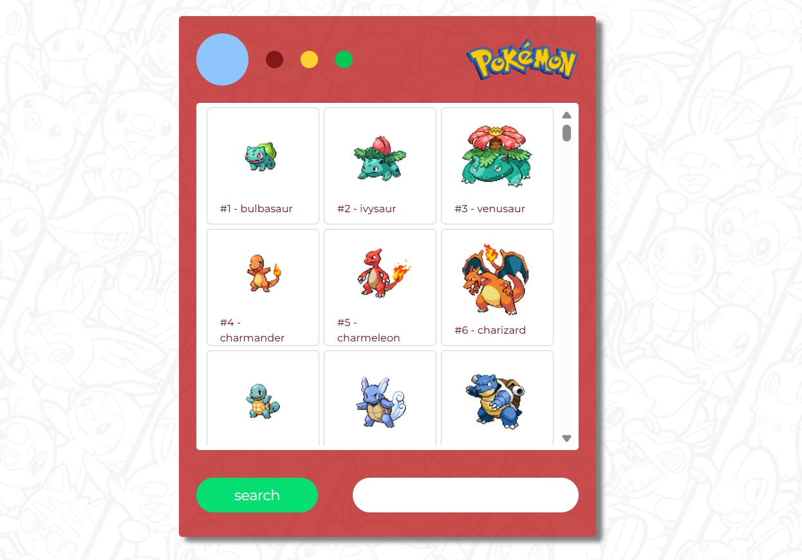

# Pokedex (pokeAPI)
Projeto de Pokédex desenvolvido com foco na integração com API pública, permitindo a busca e exibição dinâmica de informações sobre diversos Pokémon. A aplicação realiza requisições assíncronas para exibir os dados de forma interativa e em tempo real.

## 💻 Demonstração

🔗 [Acesse aqui a versão online](https://victorbonifac10.github.io/poke-api/)

## ✨ Recursos

- HTML5
- CSS3 
- JavaScript
- Consumo de API
- Design responsivo
- Código limpo e organizado

## 📌 Observações

Este projeto foi desenvolvido com o objetivo de praticar o consumo de APIs e a manipulação de dados obtidos via requisições HTTP utilizando JavaScript. A proposta envolve integrar dados externos à interface, atualizando o conteúdo de forma dinâmica e interativa, reforçando conceitos de programação assíncrona e manipulação do DOM.

## 📬 Contato

- [GitHub Profile](https://github.com/VictorBonifac10) 
- [LinkedIn](https://www.linkedin.com/in/victor-alves-bonifacio/)
